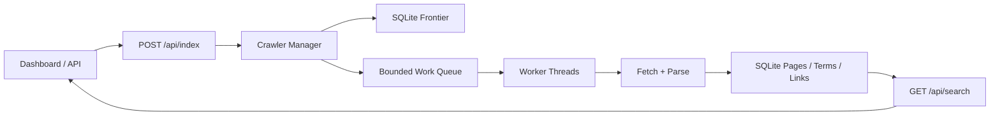

# BLG 483E HW2: Build Google with Multi-Agent AI

This project implements a single-machine web crawler and live search system for BLG 483E Homework 2. The crawler indexes pages from an origin URL up to depth `k`, prevents duplicate crawling, applies explicit back pressure, and keeps search available while indexing is still active. The implementation stays close to Python's standard library, using `urllib.request`, `html.parser`, `threading`, `queue.Queue`, `sqlite3`, and `http.server`.

HW2 extends the HW1 system with a documented multi-agent development workflow. The final runtime is still a normal localhost application, but the design and implementation process is described through separate agent roles, prompts, responsibilities, and review loops. See [multi_agent_workflow.md](multi_agent_workflow.md) and the files under [`agents/`](agents/).

## Deliverables

- Working crawler and search codebase
- [Product PRD](product_prd.md)
- [Production recommendation](recommendation.md)
- [Multi-agent workflow](multi_agent_workflow.md)
- Agent definition files in [`agents/`](agents/)

## Core Features

- `index(origin, k)` crawls reachable HTTP/HTTPS pages up to depth `k`
- `search(query)` returns triples shaped as `(relevant_url, origin_url, depth)`
- search can run while indexing is still active because pages commit incrementally into SQLite
- duplicate crawling is prevented globally through canonical URL storage and shared fetch coordination
- back pressure is enforced through a bounded in-memory queue and a shared rate limiter
- job progress, queue pressure, and event logs are exposed through a localhost dashboard
- interrupted jobs can be resumed from persisted frontier state

## Architecture Summary



### Why search works during indexing

Workers commit each fetched page independently into SQLite. Because the database uses WAL mode, search requests can read fresh rows while new pages are still being inserted. This avoids end-of-job batch indexing and makes partial crawl results visible immediately.

### Why this scales on one machine

The system separates durable crawl state from active in-memory work:

- the full frontier stays persisted in SQLite
- only a bounded slice is loaded into `queue.Queue`
- workers share a job-level rate limiter to control outbound request volume

This keeps memory growth controlled while allowing concurrent workers and resumable jobs.

## Project Layout

```text
.
|-- agents/
|-- crawler_app/
|   |-- http_server.py
|   |-- manager.py
|   |-- parser.py
|   |-- storage.py
|   `-- utils.py
|-- sample_site/
|-- static/
|-- tests/
|-- main.py
|-- product_prd.md
|-- recommendation.md
`-- multi_agent_workflow.md
```

## Run Locally

Python 3.12 is sufficient. No third-party runtime dependencies are required.

1. Start the sample site:

```bash
python -m http.server 9001 -d sample_site
```

2. Start the crawler dashboard:

```bash
python main.py --host 127.0.0.1 --port 3700 --auto-resume
```

3. Open the dashboard:

```text
http://127.0.0.1:3700
```

4. Suggested demo configuration:

```text
Origin URL: http://127.0.0.1:9001/index.html
Max Depth: 2
Workers: 4
Rate Limit: 3
Queue Limit: 64
```

5. Suggested queries:

```text
python
crawler
concurrency
```

## HTTP API

### Start a crawl

```http
POST /api/index
Content-Type: application/json

{
  "origin": "http://127.0.0.1:9001/index.html",
  "max_depth": 2,
  "worker_count": 4,
  "rate_limit": 3.0,
  "queue_limit": 64
}
```

### Search

```http
GET /api/search?q=python&limit=20
```

### Observe state

```http
GET /api/status
GET /api/jobs
GET /api/jobs/{job_id}
POST /api/jobs/{job_id}/resume
```

## Testing

Run:

```bash
python -m unittest discover -s tests -v
```

The test suite verifies:

- crawl completion and indexed search results
- search visibility while indexing is still active
- resume behavior after interruption

## Notes on HW2 Interpretation

- The runtime system is not a multi-agent runtime; the multi-agent requirement applies to the development workflow.
- The repository therefore includes explicit agent definitions, interaction rules, and a workflow document that describes how AI agents collaborate and how final decisions are made.
- The implementation still prioritizes native language features over external crawler frameworks, as required by the assignment.
